<div align="center">

# roadrisk-live — Accident Severity With Correct Live Weather And Honest Forecasts

**roadrisk-live is a road-accident analytics toolkit for US-Accidents and live OpenWeather data. It takes accident records and current weather through these steps to a severity score and a backtested daily-count forecast:**

`validate` → `features` → `split by date` → `train + select on valid` → `test once` → `live score` → `rolling-origin forecast`.


**[Summary](#1-summary)** ·
**[Workflow](#4-the-end-to-end-workflow)** ·
**[Run it](#10-how-to-run-roadrisk-live)** ·
**[Configuration](#104-environment-variables)** ·
**[Known problems](#13-known-problems)** ·
**[Glossary](#15-glossary)**

</div>

> [!NOTE]
> This README uses ASD-STE100 Simplified Technical English. The writing rules and the project
> vocabulary are in [`docs/ste-style-guide.md`](docs/ste-style-guide.md). Each term in the
> [Glossary](#15-glossary) has only one meaning.

> [!WARNING]
> Do not use roadrisk-live for navigation, emergency dispatch or insurance decisions. A severity score
> describes the traffic impact of an accident that already happened under similar conditions. It is not
> the chance of an accident.

---

roadrisk-live predicts the severity (1 to 4) of a reported US road accident from weather, time, location and road context. It also scores the current weather at any point. The main idea is one feature path for training and live scoring. Both sides use the same weather vocabulary, the same units, the local observation time and the same scikit-learn pipeline. A second part forecasts daily accident counts and compares each model with a seasonal-naive baseline in a rolling-origin backtest.

This README is the **one location that explains all of roadrisk-live**. It gives these topics:

- the general design
- each component and its procedure, step by step
- the decision rules
- the data map
- the runbook
- the validation results and the known problems

| If you are… | Read |
|---|---|
| A manager or reviewer | [1](#1-summary), [3](#3-design-rules), [4](#4-the-end-to-end-workflow), [12](#12-validation-results), [14](#14-key-points) |
| A developer who joins the project | All sections, in sequence. Keep [10](#10-how-to-run-roadrisk-live) and [13](#13-known-problems) open while you work |
| An operator who runs roadrisk-live | [10](#10-how-to-run-roadrisk-live), then the section for the component that you use |

---

## Table of contents

1. 🧭 [Summary](#1-summary)
2. 🏗️ [How roadrisk-live is built](#2-how-roadrisk-live-is-built)
   - 2.1 [Components](#21-components)
   - 2.2 [System context](#22-system-context)
   - 2.3 [Repository layout](#23-repository-layout)
3. 🛡️ [Design rules](#3-design-rules)
4. 🔄 [The end-to-end workflow](#4-the-end-to-end-workflow)
   - 4.1 [Full flow](#41-full-flow)
   - 4.2 [The life cycle of one live score](#42-the-life-cycle-of-one-live-score)
   - 4.3 [Who does which step](#43-who-does-which-step)
5. 🔵 [Data preparation and features](#5-data-preparation-and-features)
6. 🟢 [The severity models](#6-the-severity-models)
7. 🟣 [Live scoring and the count forecasts](#7-live-scoring-and-the-count-forecasts)
8. ⚖️ [Decision rules, ranges and metrics](#8-decision-rules-ranges-and-metrics)
9. 🗂️ [Data and file map](#9-data-and-file-map)
10. ▶️ [How to run roadrisk-live](#10-how-to-run-roadrisk-live)
    - 10.1 [Prerequisites](#101-prerequisites) · 10.2 [Installation](#102-installation) · 10.3 [Run roadrisk-live](#103-run-roadrisk-live) · 10.4 [Environment variables](#104-environment-variables)
11. 🧩 [How to extend roadrisk-live](#11-how-to-extend-roadrisk-live)
12. ✅ [Validation results](#12-validation-results)
13. ⚠️ [Known problems](#13-known-problems)
14. 📌 [Key points](#14-key-points)
15. 📖 [Glossary](#15-glossary)
16. 📄 [License](#16-license)

---

## 1. Summary

**The problem.** A severity model with a live weather feed has many places where the numbers can be wrong without an error message. The difficult questions are:

- Does oversampling or scaling see the test rows before the split?
- Is a live temperature in Kelvin read as Fahrenheit?
- Do live weather words match the training words, and does the live row use the observation time?
- Does a random split hide the change of severity by year and by source?
- Does a forecast train on its own forecasts, and does it beat a seasonal-naive baseline?

roadrisk-live gives each of these questions its own component and its own tests.

| Item | Value |
|---|---|
| Input | US-Accidents CSV or parquet. OpenWeather current weather for a point (optional key) |
| Output | Feature table and split report, a model bundle with a report, live scores, a forecast backtest |
| Components | **6**: data preparation, weather vocabulary and units, severity models, live scoring, HTTP API, count forecasts |
| Providers | OpenWeather (live weather, reverse geocoding). Optional |
| Offline mode | Synthetic accidents and daily counts, recorded weather fixtures, all models, the backtest |
| Safety | Split by date first, preprocessing fit on train only, range checks on live values, key only in the environment |
| Tests | **35** unit tests (`pytest`). All 35 run in CI with no optional extra |

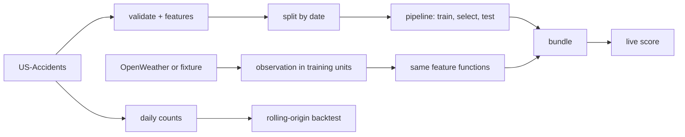

---

## 2. How roadrisk-live is built

### 2.1 Components

| Component | Module | Purpose |
|---|---|---|
| Settings | `src/roadrisk_live/config.py` | Settings from environment variables, the key hidden from `repr` |
| Weather vocabulary and units | `src/roadrisk_live/features/weather.py` | Text and OpenWeather id mapping, unit conversions, physical ranges |
| Feature functions | `src/roadrisk_live/features/build.py` | Time features, geo cell, range clipping, the preprocessing transformer |
| Accident data | `src/roadrisk_live/data/accidents.py` | Chunked loader, validation, time split, split report, daily counts |
| Synthetic data | `src/roadrisk_live/data/synthetic.py` | Accident rows with weather effects and drift, daily counts |
| Severity models | `src/roadrisk_live/severity.py` | Pipelines, class weights, selection on valid, test report, bundle |
| Weather providers | `src/roadrisk_live/serving/weather.py` | OpenWeather parser and client, fixture provider |
| Live scoring | `src/roadrisk_live/serving/scoring.py` | Observation to feature row, range checks, probabilities |
| HTTP API | `src/roadrisk_live/serving/api.py` | `/health`, `/score` with an optional bearer token (extra `api`) |
| Forecasters | `src/roadrisk_live/forecast/models.py` | Naive, seasonal naive, Holt-Winters, lag regression |
| Backtest | `src/roadrisk_live/forecast/backtest.py` | Rolling-origin evaluation and summary |
| CLI | `src/roadrisk_live/cli.py` | The `roadrisk` command |

The component map shows which module calls which module. An arrow points from the caller to the module that it uses.

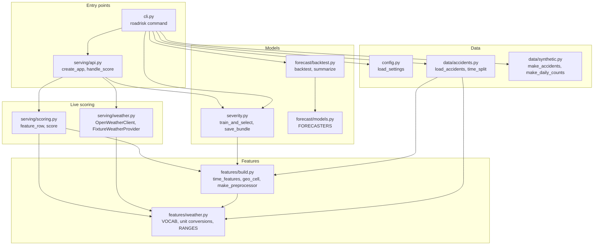

### 2.2 System context

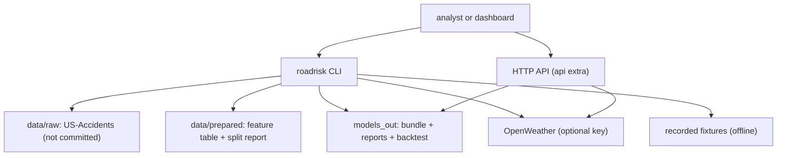

### 2.3 Repository layout

```
roadrisk-live/
├── data/README.md               sources, licenses, columns, download
├── docs/ste-style-guide.md      writing rules and project vocabulary
├── src/roadrisk_live/
│   ├── data/                    accident loader, time split, synthetic data
│   ├── features/                weather vocabulary, units, time and location features
│   ├── serving/                 weather providers, fixtures, live scoring, HTTP API
│   ├── forecast/                forecasters and the rolling-origin backtest
│   ├── severity.py              pipelines, selection, test report, bundle
│   ├── config.py                settings
│   └── cli.py                   the roadrisk command
├── tests/                       pytest suite
└── pyproject.toml               package, extras and the console script
```

---

## 3. Design rules

### 3.1 Split by date first
`time_split` puts each accident in `train`, `valid` or `test` by its date before any model step. There is no oversampling. Class weights come from the train split only.

### 3.2 One pipeline for all preprocessing
Imputation, scaling and one-hot encoding are steps of the scikit-learn pipeline. They are fit on the train split only, and the bundle carries them to live scoring.

### 3.3 One weather vocabulary
`from_text` maps the training conditions and `from_openweather_id` maps the live condition ids to the same eleven categories.

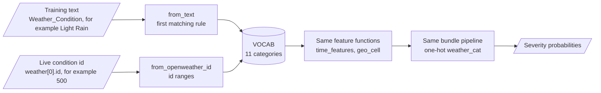

### 3.4 Correct units and range checks
`parse_current` reads the units of the request and converts each value to the training unit. `feature_row` refuses a value outside its physical range, so a unit error stops with an error and never reaches the model.

### 3.5 Observation time, not server time
The live time features come from the observation time `dt` and the location's `timezone` offset. Night comes from the sunrise and sunset of the response.

### 3.6 No placeholder codes
City is not a feature. Location is the state and a 0.5-degree geo cell. An unknown state or a rare cell goes to the encoder's infrequent column, not to a real code.

### 3.7 Forecasts see the past only
Each forecaster gets the history up to the origin. No forecaster trains on a forecast. Every model is compared with the seasonal-naive baseline out of sample.

### 3.8 The key stays in the environment
`OPENWEATHER_API_KEY` is read from the environment. `Settings` hides it from `repr`, and no file in the repository holds a key.

---

## 4. The end-to-end workflow

### 4.1 Full flow

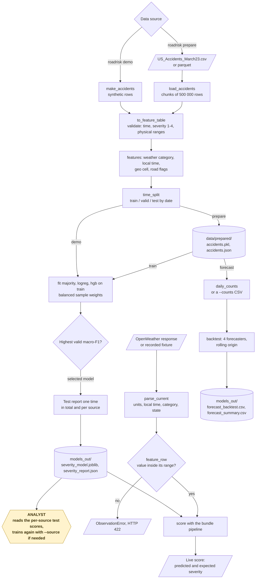

### 4.2 The life cycle of one live score

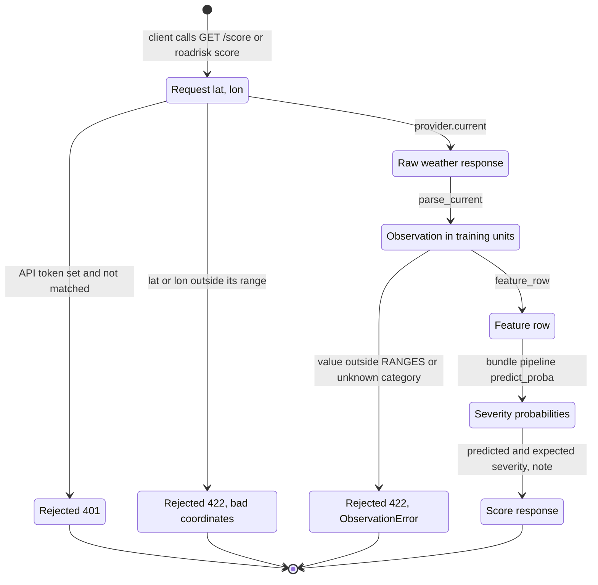

1. The client asks for a score at a latitude and a longitude.
2. The provider gets the current weather (OpenWeather) or the nearest fixture (offline).
3. The parser converts the temperature, pressure, visibility, wind and rain to the training units.
4. The parser maps the condition id to a weather category.
5. The parser shifts the observation time to the local time of the point.
6. The scoring step checks each value against its physical range.
7. The scoring step builds one feature row with the training feature functions.
8. The bundle pipeline gives the four severity probabilities.
9. The response gives the predicted severity, the expected severity and a note on its meaning.

### 4.3 Who does which step

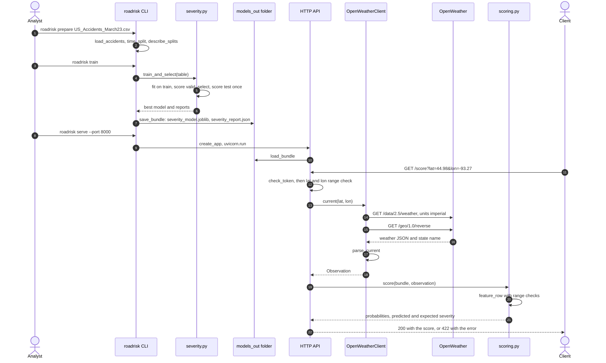

---

## 5. Data preparation and features

**Purpose.** Turn the accident file into a validated feature table, split by date.

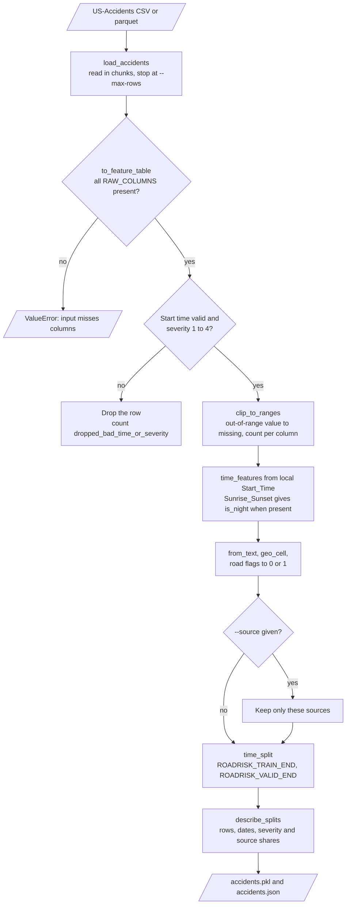

| Input | Output |
|---|---|
| US-Accidents CSV or parquet | `accidents.pkl` (feature table with `split`) and `accidents.json` (report) |

**Procedure**

1. Read the needed columns in chunks of 500 000 rows. Read all rows unless you give `--max-rows`.
2. Drop rows with no valid start time or with a severity outside 1 to 4.
3. Set values outside their physical range to missing, and count them per column.
4. Make the time features from the local start time. Use `Sunrise_Sunset` for night when it exists.
5. Map `Weather_Condition` to the weather vocabulary.
6. Make the geo cell from the start latitude and longitude.
7. Turn the road flags into 0 or 1.
8. Split by date: train up to `ROADRISK_TRAIN_END`, valid up to `ROADRISK_VALID_END`, test after it.
9. Write the table and the report with rows, dates, severity shares and source shares per split.

| Feature group | Columns |
|---|---|
| Weather | `temperature_f`, `humidity_pct`, `pressure_in`, `visibility_mi`, `wind_speed_mph`, `precipitation_in`, `weather_cat` |
| Time | `hour`, `weekday`, `month`, `is_weekend`, `is_rush_hour`, `is_night` |
| Location | `state`, `geo_cell` |
| Road | `junction`, `traffic_signal`, `crossing`, `station`, `stop`, `amenity`, `bump`, `give_way`, `no_exit`, `railway`, `roundabout`, `traffic_calming` |

Use `--source Source1` (repeatable) to train on one source only, because the severity mix differs by source.

---

## 6. The severity models

**Purpose.** Predict severity with a leak-free pipeline and select the model on later data.

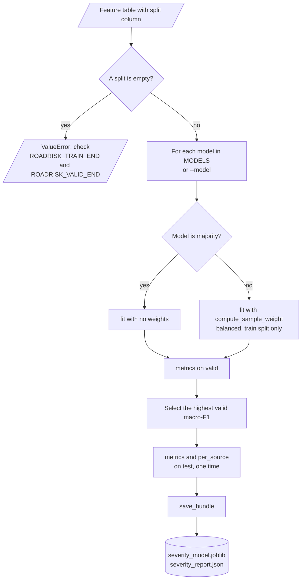

| Model | Classifier | Imbalance |
|---|---|---|
| `majority` | Most frequent class (no weights) | - |
| `logreg` | Multinomial logistic regression | Balanced sample weights from train |
| `hgb` | Histogram gradient boosting (200 iterations, learning rate 0.1, 31 leaves) | Balanced sample weights from train |

**Preprocessing (inside each pipeline)**

| Column type | Steps |
|---|---|
| Numeric | Median imputation with missing indicators, standard scaling |
| Flags | Missing as 0 |
| Categorical | Missing as `unknown`, one-hot with `min_frequency=20` and `handle_unknown="infrequent_if_exist"` |

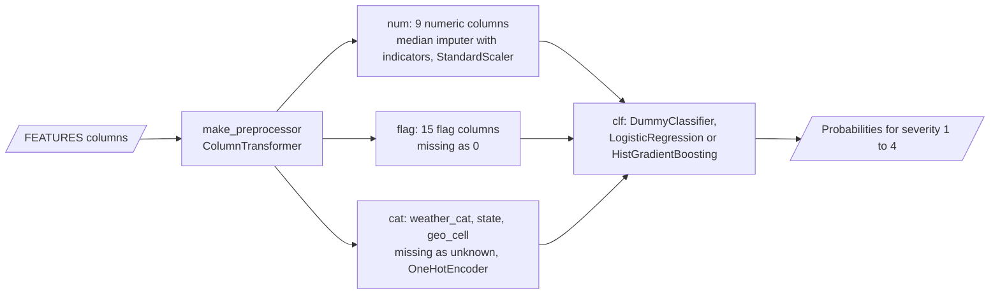

**Procedure**

1. Fit each model on the train split with balanced sample weights.
2. Score each model on the valid split. Select the highest macro-F1.
3. Score the selected model on the test split one time, in total and per source.
4. Save the bundle: pipeline, feature list, classes, model name and training window.

---

## 7. Live scoring and the count forecasts

**Live scoring.** `roadrisk score LAT LON` and `GET /score?lat=..&lon=..` use the `OpenWeatherClient` when `OPENWEATHER_API_KEY` is set, else the `FixtureWeatherProvider`.

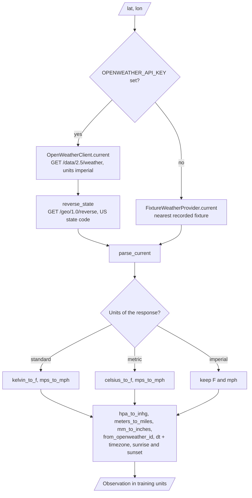

| OpenWeather field | Training unit | Conversion |
|---|---|---|
| `main.temp` | °F | Kelvin (`standard`) or Celsius (`metric`) converted. `imperial` kept |
| `main.pressure` (hPa) | inHg | × 0.02953 |
| `visibility` (m) | miles | ÷ 1609.344 |
| `wind.speed` | mph | m/s × 2.2369, `imperial` kept |
| `rain.1h` + `snow.1h` (mm) | inches | ÷ 25.4 |
| `weather[0].id` | weather category | `from_openweather_id` |
| `dt` + `timezone` | local time | UTC time plus the offset |
| `sys.sunrise`, `sys.sunset` | `is_night` | Night outside sunrise to sunset |

Road flags are not in the weather response, so a live row uses 0 for them unless the caller gives them.

**Count forecasts.** `roadrisk forecast` runs the rolling-origin backtest.

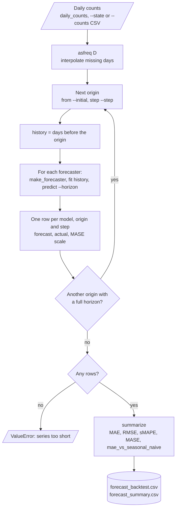

| Forecaster | Method |
|---|---|
| `naive` | The last value |
| `seasonal_naive` | The value of the same weekday one week before |
| `holt_winters` | Additive level, trend and weekly season. Smoothing chosen on one-step errors inside the history |
| `lag_regression` | Ridge regression on weekday, day-of-year, trend and lags of 7, 14, 21 and 28 days (horizon up to 7) |

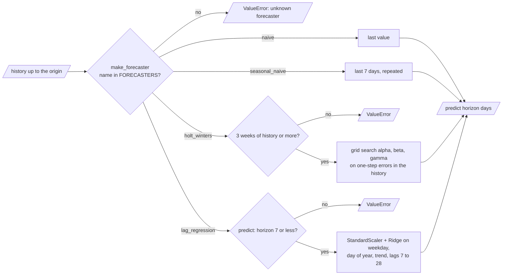

**Backtest procedure**

1. Start at day `--initial` (default 365). Move the origin by `--step` days (default 28).
2. At each origin, fit each forecaster on the history before the origin.
3. Forecast the next `--horizon` days (default 7) and compare with the actual counts.
4. Report MAE, RMSE, sMAPE, MASE and the MAE relative to the seasonal-naive baseline.

---

## 8. Decision rules, ranges and metrics

The HTTP API applies these checks in this sequence before the model sees a live row. `roadrisk score` applies the same checks, but not the token check.

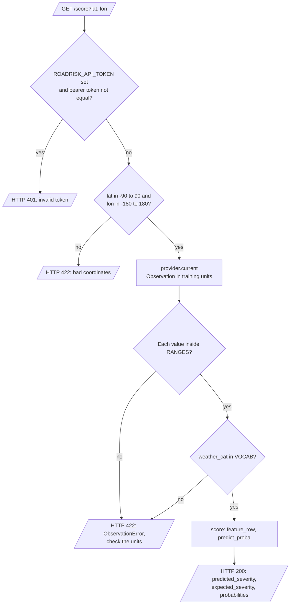

| Live value | Allowed range | Action outside the range |
|---|---|---|
| `temperature_f` | -60 to 135 | Refuse with HTTP 422 (training rows: set to missing) |
| `humidity_pct` | 0 to 100 | Same |
| `pressure_in` | 25 to 32.5 | Same |
| `visibility_mi` | 0 to 100 | Same |
| `wind_speed_mph` | 0 to 150 | Same |
| `precipitation_in` | 0 to 10 | Same |

| Severity metric | Definition |
|---|---|
| `macro_f1` | Mean F1 of the four severities. The selection metric |
| `balanced_accuracy` | Mean recall of the four severities |
| `per_class_recall` | Recall of each severity |
| `confusion` | 4 × 4 matrix, rows are the true severities |
| `ece` | Expected calibration error of the top class, 10 bins |

| Forecast metric | Definition |
|---|---|
| MAE, RMSE | Mean absolute and root mean squared error over all origins and steps |
| sMAPE | Symmetric mean absolute percentage error |
| MASE | MAE divided by the in-sample seasonal-naive MAE of the same history |
| `mae_vs_seasonal_naive` | MAE divided by the MAE of the seasonal-naive forecaster. Less than 1 is better |

---

## 9. Data and file map

| Path | Committed? | Contents |
|---|---|---|
| `data/README.md` | Yes | Sources, licenses, columns, download |
| `src/roadrisk_live/serving/fixtures/*.json` | Yes | Three illustrative weather responses (standard, metric, imperial units) |
| `data/raw/` | No (git ignores it) | US-Accidents or synthetic files |
| `data/prepared/accidents.pkl`, `.json` | No (git ignores it) | Feature table and split report |
| `models_out/severity_model.joblib` | No (git ignores it) | The bundle |
| `models_out/severity_report.json` | No (git ignores it) | Valid and test reports |
| `models_out/forecast_backtest.csv`, `forecast_summary.csv` | No (git ignores it) | Backtest rows and summary |
| `.env.example` | Yes | Variable names only |

---

## 10. How to run roadrisk-live

### 10.1 Prerequisites

| Need | For |
|---|---|
| Python 3.11+ | All components |
| `fastapi`, `uvicorn` (extra `api`) | `roadrisk serve` |
| `pyarrow` (extra `parquet`) | Parquet input |
| An OpenWeather key | Live weather. Without a key, the fixtures are used |
| About 8 GB of memory | The full US-Accidents file |

### 10.2 Installation

```bash
git clone https://github.com/KrishnaAnnavaram/roadrisk-live.git
cd roadrisk-live
python -m venv .venv
. .venv/bin/activate            # Windows: .venv\Scripts\activate
pip install -e ".[dev]"         # core + tests
pip install -e ".[all]"         # optional: API and parquet
```

### 10.3 Run roadrisk-live

```bash
# 1. offline demo: synthetic accidents, three models, fixture weather, forecast backtest
roadrisk demo

# 2. real data (see data/README.md)
roadrisk prepare data/raw/US_Accidents_March23.csv
roadrisk train
roadrisk forecast --state CA
export OPENWEATHER_API_KEY=<your key>          # keep it in .env, never in code
roadrisk score 44.98 -93.27
roadrisk serve --port 8000                      # GET /score?lat=44.98&lon=-93.27
```

`python -m roadrisk_live` is the same as the `roadrisk` command.

The commands use the files of the commands before them. An arrow points from a command to the command that reads its output.

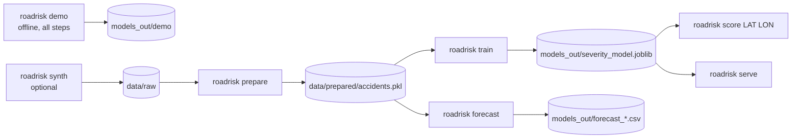

### 10.4 Environment variables

| Variable | Used by | Meaning |
|---|---|---|
| `OPENWEATHER_API_KEY` | Live scoring | OpenWeather key. Empty: the offline fixtures |
| `ROADRISK_OPENWEATHER_URL` | Live scoring | Base URL. Default `https://api.openweathermap.org` |
| `ROADRISK_TIMEOUT_S` | Live scoring | HTTP timeout in seconds. Default `10` |
| `ROADRISK_DATA_DIR` | CLI | Base folder for `raw/` and `prepared/`. Default `data` |
| `ROADRISK_MODEL_DIR` | CLI, API | Folder for the bundle and the reports. Default `models_out` |
| `ROADRISK_SEED` | Models, synthetic data | Default `13` |
| `ROADRISK_TRAIN_END` | Split | Last day of the train split. Default `2021-12-31` |
| `ROADRISK_VALID_END` | Split | Last day of the valid split. Default `2022-12-31` |
| `ROADRISK_API_TOKEN` | HTTP API | Bearer token. Empty: no token check |

Credentials are only in a local `.env` file. Git ignores this file. Do not print or commit credentials.

---

## 11. How to extend roadrisk-live

| You want to… | Do this | Code change? |
|---|---|---|
| Add a weather category | Add it to `VOCAB` and to both mapping functions, then train again | Small |
| Use another split year | Set `ROADRISK_TRAIN_END` and `ROADRISK_VALID_END` | No |
| Add a model | Add a branch in `make_model` and a name in `MODELS` | Small |
| Use H3 cells | Replace `geo_cell` in `features/build.py` (one function for both sides) | Small |
| Forecast per state | `roadrisk forecast --state TX` | No |
| Add a forecaster | Implement `fit(history)` and `predict(horizon)` and add it to `FORECASTERS` | Small |
| Track runs in MLflow | Log `severity_report.json` and the bundle after `train` | Yes |

---

## 12. Validation results

| Validation | Result | Command |
|---|---|---|
| Unit tests (CI installs only `.[dev]`) | **35 passed**, 0 skipped. No test needs an optional extra | `pytest -q` |
| Offline demo, severity (synthetic data) | See the first table | `roadrisk demo` |
| Offline demo, live scores (fixtures) | See the second table | `roadrisk demo` |
| Offline demo, forecast backtest (synthetic counts) | See the third table | `roadrisk demo` |

Offline demo, **synthetic accidents**: 20 000 rows (2018 to March 2023), 20 rows dropped (severity 0) and 20 temperatures of 520 °F set to missing. Train 15 336 rows (to 2021), valid 3 734 (2022), test 910 (2023):

| Model | Valid macro-F1 | Test macro-F1 | Test balanced accuracy | Test recall per severity (1 / 2 / 3 / 4) |
|---|---|---|---|---|
| `majority` | 0.225 | - | - | - |
| `logreg` | 0.358 | - | - | - |
| `hgb` (selected on valid) | 0.410 | 0.398 | 0.424 | 0.24 / 0.77 / 0.46 / 0.23 |

Only the selected model is scored on the test split.

Live scores with the recorded **fixtures** and the demo model:

| Fixture | Units in the response | Parsed values | Weather category | Predicted severity | Expected severity |
|---|---|---|---|---|---|
| Minneapolis | standard (Kelvin, m/s) | 19.4 °F, local 00:30, night | `snow` | 4 | 3.90 |
| Miami | metric (Celsius, m/s) | 81.3 °F, local 11:00 | `heavy_rain` | 3 | 2.97 |
| Denver | imperial (Fahrenheit, mph) | 71.3 °F, local 11:00 | `clear` | 2 | 2.17 |

Forecast backtest on **synthetic daily counts** (1200 days, 30 origins, horizon 7 days):

| Forecaster | MAE | RMSE | sMAPE % | MASE | MAE vs seasonal naive |
|---|---|---|---|---|---|
| `holt_winters` | 69.7 | 132.1 | 4.07 | 0.836 | 0.985 |
| `seasonal_naive` | 70.7 | 133.7 | 3.93 | 0.848 | 1.000 |
| `lag_regression` | 74.7 | 136.6 | 4.03 | 0.897 | 1.057 |
| `naive` | 293.7 | 460.5 | 15.84 | 3.507 | 4.152 |

The synthetic counts have a strong weekly cycle, so the seasonal-naive baseline is hard to beat. Holt-Winters beats it by 1.5 % and the lag regression does not beat it.

These numbers show that the pipeline, the unit handling and the backtest work end to end. They come from synthetic data and illustrative weather responses, so they say nothing about real accidents.

The prototype reported test accuracy values (0.91 to 0.95) and a forecast R² of 0.70. Those are prototype results, not reproduced here. They came from oversampled rows in the test split and from in-sample forecast windows.

---

## 13. Known problems

Read these problems before you use roadrisk-live results.

| # | Area | Problem | Impact and action |
|---|---|---|---|
| 1 | Results | No result on the real US-Accidents file is in this repository | Run `prepare` and `train` and keep `severity_report.json` |
| 2 | Target | Severity measures traffic delay and its mix changes by source and year | Read the per-source test scores. Train on one source with `--source` if the mix differs |
| 3 | Live rows | The weather response has no road context, so the road flags are 0 | Give road flags from a map service for better live scores |
| 4 | Selection bias | The data holds reported accidents only. A score is not the chance of an accident | Do not present the score as a risk of a crash |
| 5 | Weather match | Weather in US-Accidents comes from the nearest airport station, live weather from OpenWeather | Expect a small shift between training and live weather values |
| 6 | Forecast | The lag regression supports a horizon of 7 days. No holiday calendar | Add holiday features for longer horizons |
| 7 | Memory | The full file needs several GB of memory in pandas | Use `--max-rows` for trials or the parquet input |
| 8 | License | US-Accidents is CC BY-NC-SA 4.0 | Do not use it for commercial work |

---

## 14. Key points

1. **Split by date, then fit.** No oversampling, and preprocessing statistics come from train only.
2. **One weather vocabulary.** Training text and live condition ids map to the same eleven categories.
3. **Units are converted and checked.** A Kelvin temperature cannot reach the model as Fahrenheit.
4. **Local observation time.** Live time features use the time of the observation at the point.
5. **Forecasts beat a baseline or say so.** Every forecaster is backtested against seasonal naive.
6. **Keys stay in the environment.** The offline fixtures make every test and the demo key-free.

---

## 15. Glossary

| Term | Meaning |
|---|---|
| **Accident** | One row of US-Accidents |
| **Severity** | The impact level 1 to 4 (traffic delay) |
| **Source** | The data provider column of US-Accidents |
| **Feature table** | The validated table with the model inputs and the target |
| **Split** | `train`, `valid` or `test`, by date |
| **Training window** | The dates of the train split |
| **Weather vocabulary** | The eleven weather categories |
| **Observation** | One parsed live weather response in training units |
| **Provider** | A source of observations |
| **Fixture** | A recorded example weather response |
| **Geo cell** | A 0.5-degree latitude and longitude square |
| **Pipeline** | Preprocessing plus classifier |
| **Bundle** | The saved pipeline with its feature list and window |
| **Live score** | The severity probabilities for one observation |
| **Daily count** | The number of accidents on one day |
| **Forecaster** | A daily count model |
| **Origin** | The last day of history before a forecast |
| **Horizon** | The number of days that a forecast covers |
| **Backtest** | The rolling-origin evaluation of the forecasters |

---

## 16. License

[MIT](LICENSE) © 2026 Krishna Annavaram
